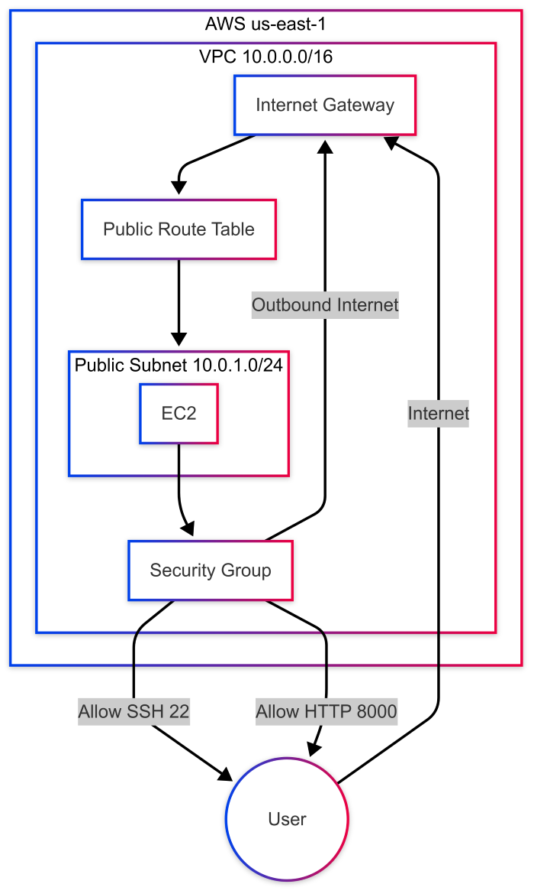

# Initial AWS Infrastructure with Terraform

{ width=200px }

We began the implementation of our cloud infrastructure by specifying the AWS region as `us-east-1`, the only region provided by our educational AWS lab.

We then created a Virtual Private Cloud (VPC) with the CIDR block `10.0.0.0/16`. To enable internet connectivity, we set up an internet gateway and created a routing table associated with this gateway. Then, we reserved a subnet within this VPC using the CIDR `10.0.1.0/24` and associated it with the previously configured routing table.

Next, we configured a security group with the following rules:
- Allowed inbound SSH (`port 22`) from `var.my_ip_cidr`, a variable that can be dynamically updated to restrict access to a specific IP address or range.
- Allowed inbound traffic on port `8000`, the default port for our backend application, from a public CIDR, permitting access from any IP address.
- Initially permitted inbound traffic on port `3000`, anticipating its use for frontend deployment.
- Allowed all outbound traffic from our instance to the internet.

For SSH access, we defined a key pair with and output public key to the known ssh hosts folder on the local device.

We then provisioned an EC2 instance of type `t2.micro`, chosen for its suitability to our lightweight backend requirements. After researching the Amazon Machine Image (AMI) catalog, we selected an Ubuntu-based image (`ami-084568db4383264d4`).

Finally, we associated the EC2 instance with our previously defined VPC and internet-accessible subnet. Additionally, we attached a user-data script (executed upon initial instance launch) that installs Docker, anticipating its use for future application deployments.